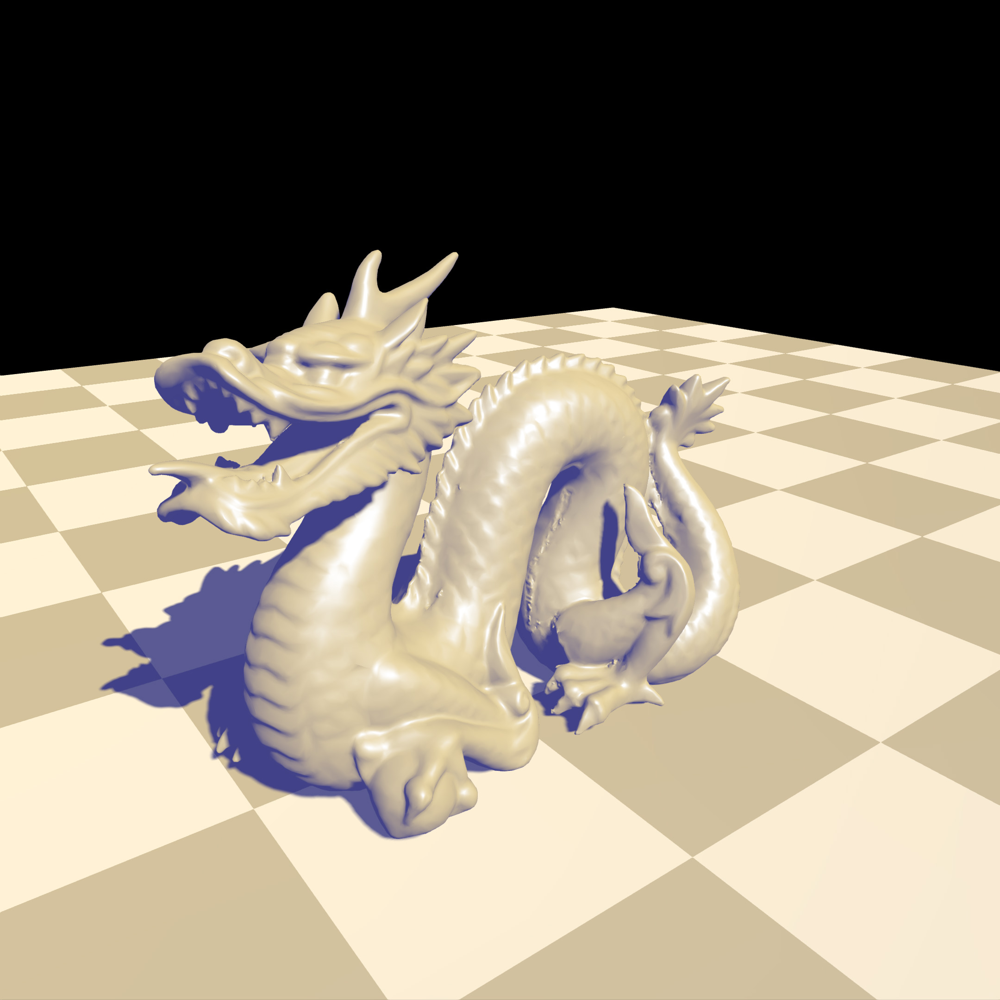
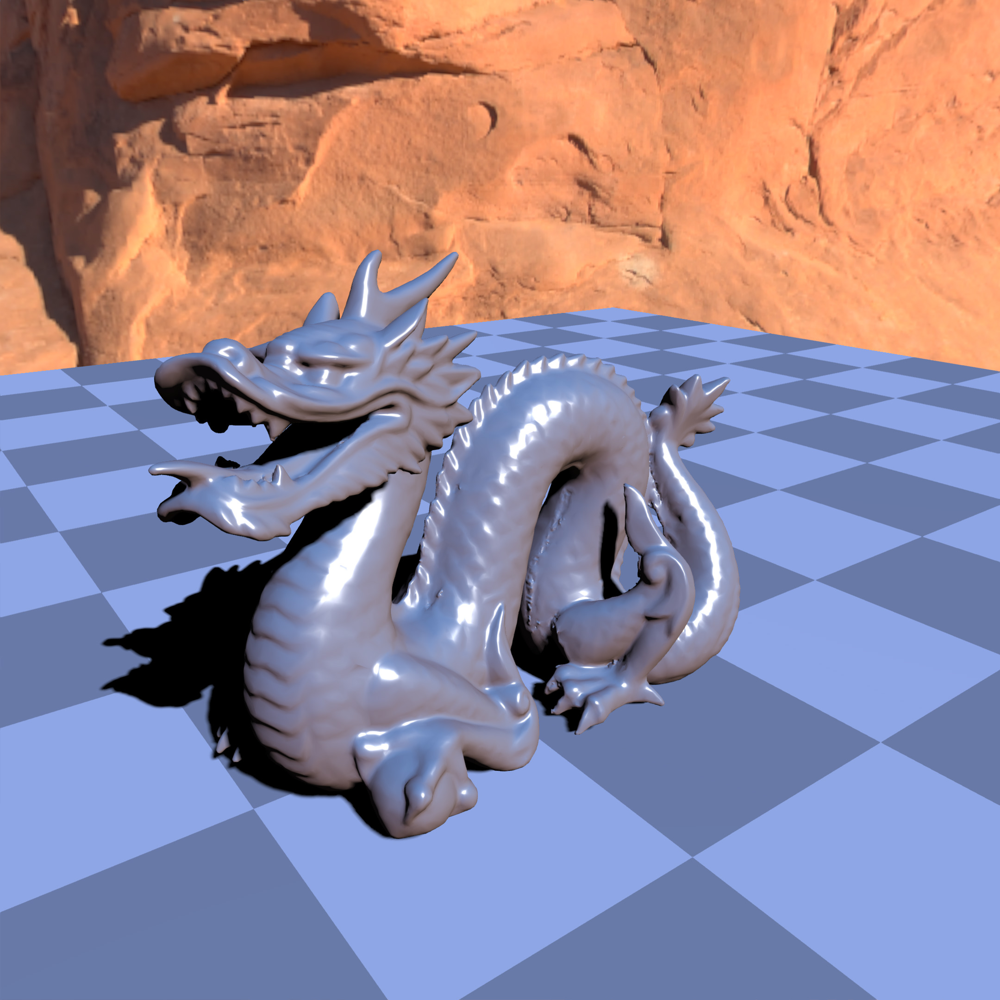
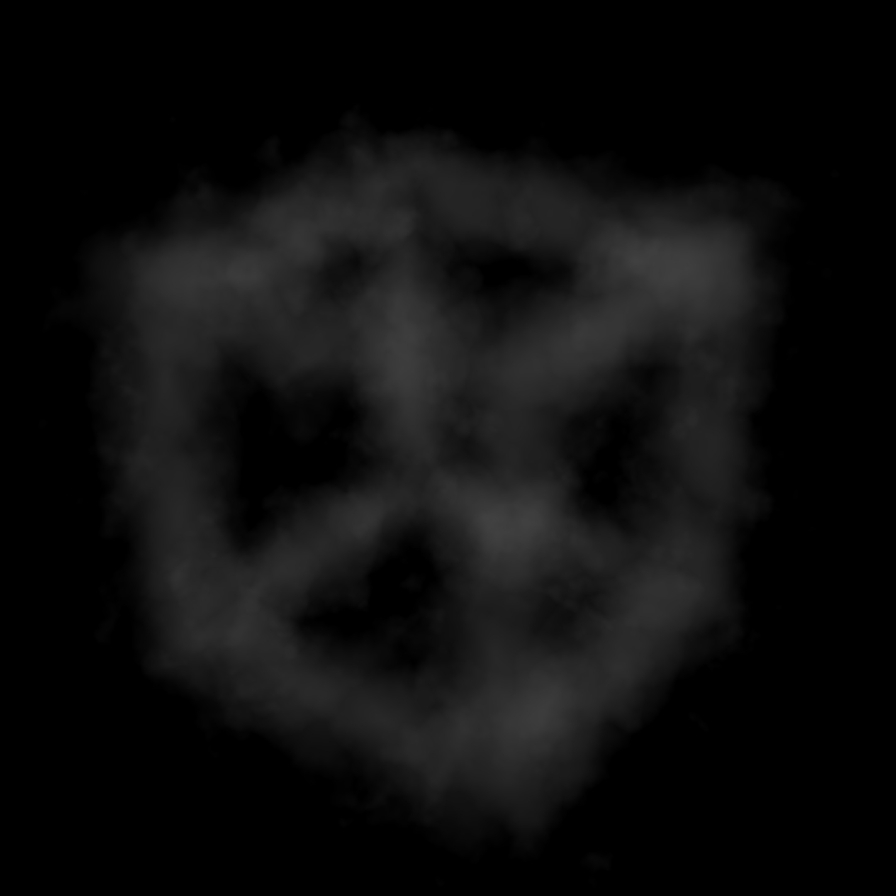

You can try this examples with

* [glslViewer](https://github.com/patriciogonzalezvivo/glslViewer/wiki/Compiling)
* [glsl-canvas VS Code pluging](https://marketplace.visualstudio.com/items?itemName=circledev.glsl-canvas)
* ...


## How to start?

Clone this repository recursivelly

```bash
git clone --recursive https://github.com/patriciogonzalezvivo/lygia_examples.git
```

# DRAW

#### Digits

```bash
glslViewer draw_digits.frag -l
```


# LIGHTING

#### Gooch

```bash
glslViewer assets/dragon.obj lighting_gooch.frag -e camera_position,1.43923,-0.891203,-1.98093 -l
```




#### PBR little 

```bash
glslViewer assets/dragon.obj lighting_pbrLittle.frag -e camera_position,1.43923,-0.891203,-1.98093 -l
```


#### PBR little with cubemap

```bash
glslViewer assets/dragon.obj lighting_pbrLittle.frag -e camera_position,1.43923,-0.891203,-1.98093 -C assets/uffizi_cross.hdr -e dynamic_shadows,on -l 
```




#### Raymarching 

```bash
glslViewer lighting_raymarching.frag -e camera_position,-29.5393,-26.2406,-42.1865 -l
```


#### Raymarching custom PBR

```bash
glslViewer lighting_raymarching_pbr.frag -e camera_position,-29.5393,-26.2406,-42.1865 -l
```


#### Raymarching custom PBR with CUBEMAP

```bash
glslViewer lighting_raymarching_pbr.frag -e camera_position,-29.5393,-26.2406,-42.1865 -C assets/uffizi_cross.hdr -l
```


#### Raymarching custom GLASS material

```bash
glslViewer lighting_raymarching_glass.frag -e camera_position,-29.5393,-26.2406,-42.1865 -l
```


#### Raymarching custom GLASS material with CUBEMAP

```bash
glslViewer lighting_raymarching_glass.frag -e camera_position,-29.5393,-26.2406,-42.1865 -C assets/uffizi_cross.hdr -l
```


#### Raymarching efault VOLUME

```bash
glslViewer lighting_raymarching_volume.frag -e camera_position,-29.5393,-26.2406,-42.1865 -l
```



